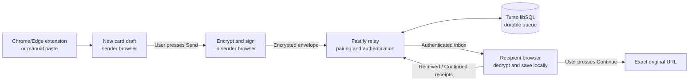
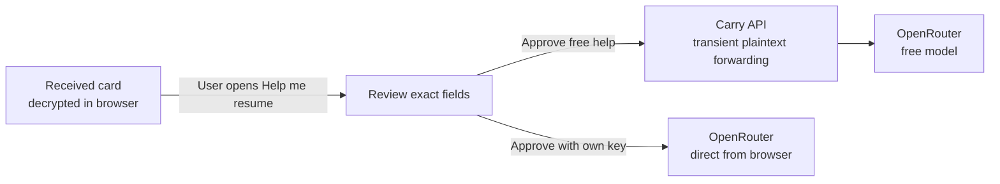

# Carry

Carry moves a page and the context for returning to it between paired browsers. Capture or paste a link, add a next action if useful, and send an encrypted card. Open it later on your other device and press **Continue**.

The web app and authenticated Fastify relay share one HTTPS origin on Render; the relay stores its durable queue in Turso. A Chrome/Edge extension can start drafts from the current tab or selected text. Android system sharing is still an opt-in preview; manual paste works everywhere.

## Use Carry

1. Open the **same Carry HTTPS address** on two devices or browser profiles. Each profile creates its own device identity.
2. On the first device, open **Pair device → Create invitation**. Scan its QR code with the second device, or open the invitation link there. Compare **all four groups** of the verification code and press **Codes match — Approve** on **both** devices. The invitation expires after five minutes.
3. On the sender, open **New card**. Paste a complete `https://` or `http://` URL, or [install the Chrome/Edge extension](apps/extension/README.md) and click **Carry this page**. For a passage, select text on the page, right-click, and choose **Carry selected text**. Review the title, link, excerpt, and optional goal, next action, related links, and note.
4. Choose the trusted device and press **Send card**. **Queued** means the encrypted card was committed to the relay. Capturing or editing a draft alone never sends it.
5. On the recipient, open **Inbox** and select **Resume**. The next action appears first. **Continue** opens the exact saved primary URL, including its query and fragment, in a new tab. A selected-passage link asks a supporting browser to highlight that passage; matching can vary by page.

Inbox refreshes while open. The recipient can be offline when you send; the card remains available until it expires after seven days. **Received** means the recipient decrypted and saved it locally. **Continued** records a click on Continue. Neither receipt removes the card before expiry. **Unpair** revokes trust and removes that pair's queued cards.

**Help me resume** is optional. It shows the exact card fields proposed for AI before **Approve and ask AI**. The free option uses Carry's configured OpenRouter account, subject to daily and provider limits. **AI settings** lets you connect your own OpenRouter account or save your own key once per browser profile. AI failure never blocks Continue.

## Run locally

Use **Node.js 24** and **pnpm 10**. From the repository root (the folder containing this README and `pnpm-workspace.yaml`):

```sh
# Only if pnpm is not installed:
npm install -g pnpm@10.34.5
pnpm install
pnpm dev
```

Open **http://127.0.0.1:5173** in two separate browser profiles and follow the steps above. On one laptop, open the invitation link in the other profile instead of scanning its QR code. Vite proxies `/api` to Fastify on `127.0.0.1:3001`; local development uses `apps/api/data/carry.sqlite`. Stop and restart the API to check that a queued card survives. Browser keys belong to each profile and origin, so keep both the same between visits.

For extension builds and loading, follow [the extension guide](apps/extension/README.md). The bundled extension opens `https://carry-hhc6.onrender.com` unless built with a different `WXT_CARRY_ORIGIN`. It is installed separately from the web service. For Android share-target testing, follow [the capture acceptance guide](docs/capture-acceptance.md); normal production builds keep manual paste available and do not enable the share target.

## How it works





The relay stores **encrypted envelopes**, routing and expiry data, and receipts; it does not store card titles, URLs, notes, excerpts, AI plans, or personal OpenRouter keys. Browser private keys are non-extractable and stored in IndexedDB. The optional free AI route sees only the **explicitly approved** plaintext while forwarding that request; it stores usage counts, not card content. With a personal key, the browser sends the approved input directly to OpenRouter. AI does not read linked pages.

Clearing site data loses that profile's keys, so it must be paired again. A web app's delivered code still matters for security; browser encryption is not a substitute for reviewing what the origin serves. See [secure handoff format and limits](docs/decisions/0003-secure-handoff.md), [capture behavior](docs/decisions/0005-page-capture.md), and [optional AI privacy boundary](docs/decisions/0007-optional-ai.md).

## Deploy

Carry runs as **one Render web service** serving both the Vite build and `/api`, with **Turso libSQL** for persistence. The root [render.yaml](render.yaml) pins the build and start commands. Set these in Render's service environment:

| Variable | Purpose |
| --- | --- |
| `TURSO_DATABASE_URL` | libSQL URL, API only |
| `TURSO_AUTH_TOKEN` | Database token, API only |
| `CARRY_OPENROUTER_FREE_KEY` | Optional server-only free AI key; omit to disable free AI |

`NODE_VERSION`, `NODE_ENV`, and `CARRY_SERVE_WEB` are set in `render.yaml`; manual web-service setup needs those too. The API applies its idempotent schema on startup. Never put database or server AI keys in `VITE_` or `WXT_` variables, the repository, or a browser bundle. For a custom domain, set `CARRY_ORIGIN` to the exact HTTPS origin used by both devices. See the [Render + Turso guide](docs/render-deployment.md) for setup, migration, and deployment checks.

## Verify changes

```sh
pnpm test
pnpm typecheck
pnpm lint
pnpm build
pnpm --filter @carry/web exec playwright install chromium
pnpm test:e2e
```

`pnpm test:e2e` uses isolated browser profiles and a temporary local relay. It builds the web app in share-preview mode; run `pnpm --filter @carry/web build` afterward to restore the normal production build. `pnpm test:extension` additionally needs installed Chrome and Edge. The [real-device checklist](docs/real-device-acceptance.md) covers a phone, HTTPS, an API restart, exact-link Continue, and expiry. Browser emulation does not replace that check.

## Workspace

| Path | Owns |
| --- | --- |
| `apps/web` | Editor, pairing, Inbox, Resume, browser identity and local card storage |
| `apps/api` | Fastify relay, authentication, envelopes, receipts, expiry, Turso/SQLite adapters |
| `apps/extension` | Chrome/Edge tab and selected-text capture |
| `packages/protocol` | Card and encrypted-envelope validation |
| `packages/crypto` | Key handling, signing, encryption, and format tests |
| `docs/decisions` | Architecture and security decisions |
